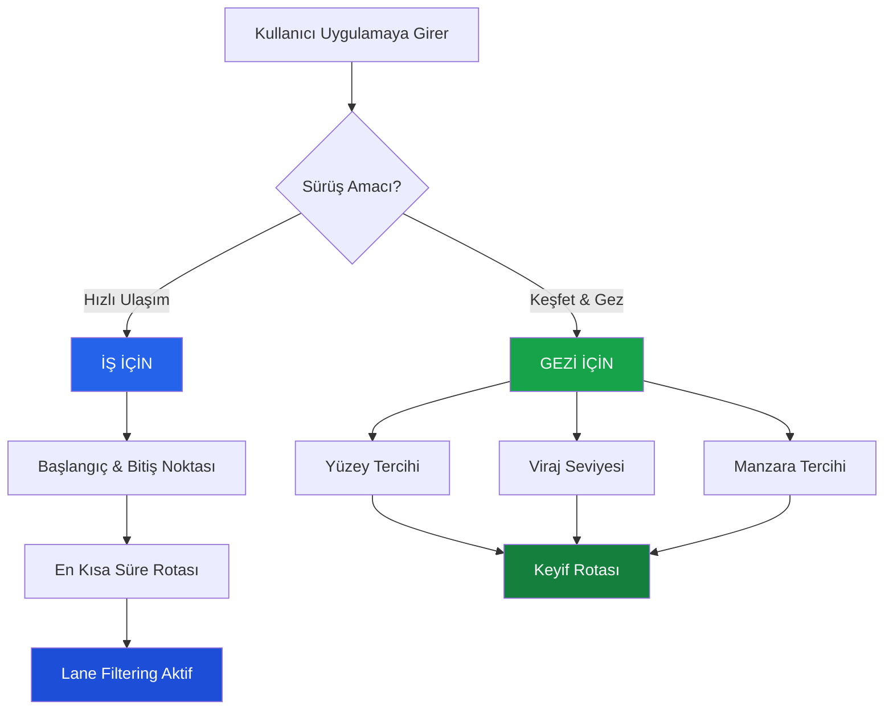
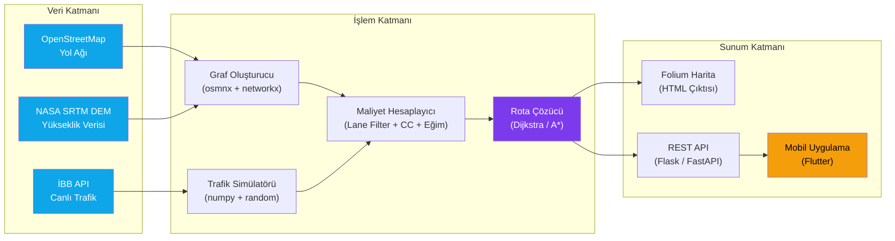
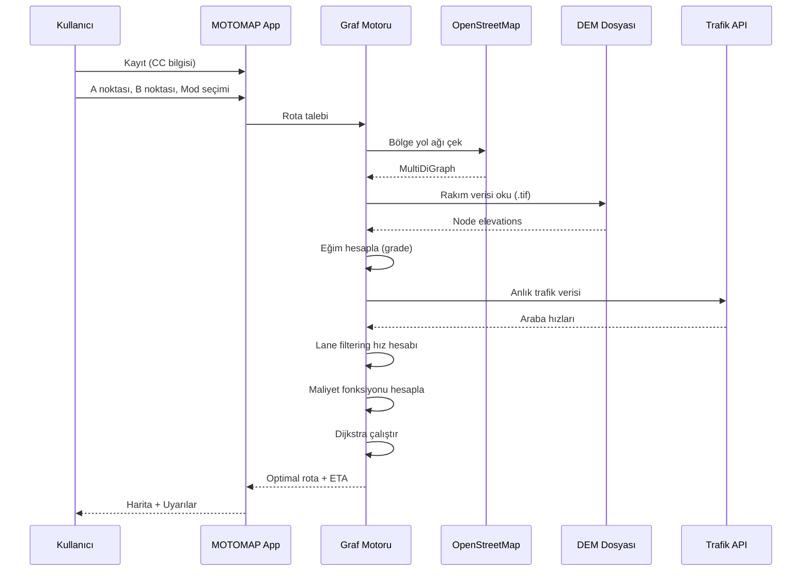
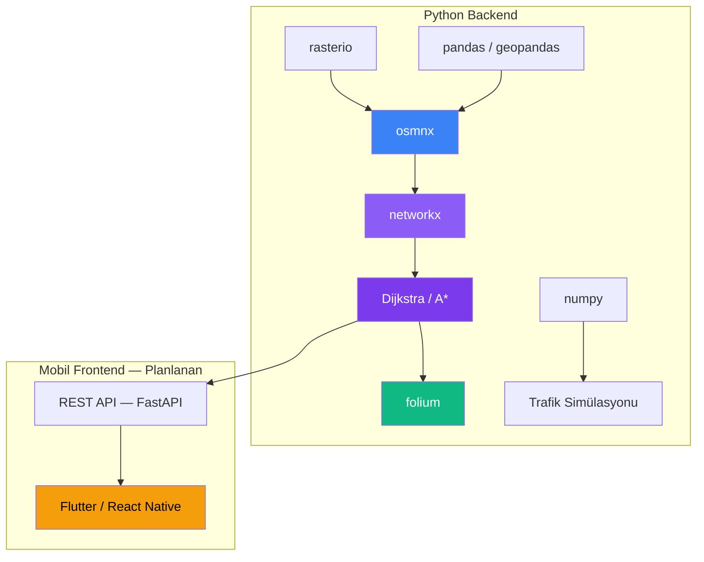
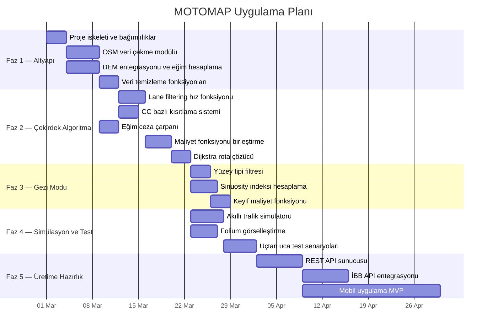
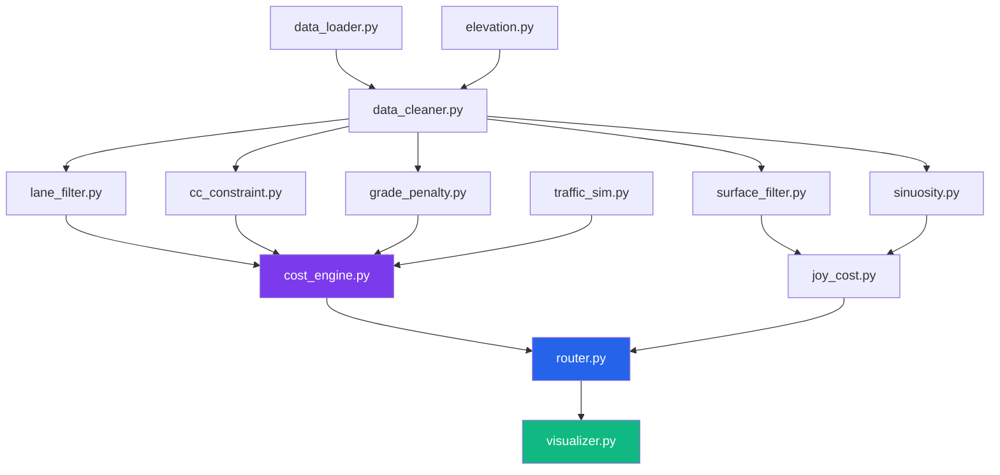

<div align="center">

# MOTOMAP

### Motosikletçiler İçin Akıllı Rota Optimizasyon Motoru

[](LICENSE)
[](https://python.org)
[]()

*Standart navigasyon uygulamaları arabalara göre rota çizerken,*
*MOTOMAP motosikletlerin fiziksel avantajlarını ve kısıtlamalarını matematiksel olarak modelleyerek*
*bireyselleştirilmiş rotalar üretir.*

</div>

---

## Neden MOTOMAP?

Mevcut navigasyon uygulamaları (Google Maps, Yandex, Apple Maps) tüm araçlara aynı rotayı sunar. Ancak motosikletler trafikte temelden farklı hareket eder:

> Sıkışık bir E-5 trafiğinde arabalar **durağan** haldeyken, motosikletler şerit aralarından sıyrılarak ilerleyebilir. Google Maps "45 dakika" gösterirken, bir motosikletçi aynı mesafeyi **15 dakikada** katedebilir.

MOTOMAP bu farkı algoritmik olarak modelleyen **ilk açık kaynak navigasyon motorudur.**

---

## Temel Özellikler

### 1. Şerit Filtreleme (Lane Filtering)

Sıkışık trafikte motosikletlerin şerit aralarından geçebilme avantajını modelleyen dinamik hız hesaplaması. Motosiklet hızı, gidiş yönündeki şerit sayısına ve anlık trafik durumuna bağlı olarak hesaplanır:

$$
V_{moto} = \begin{cases}
V_{araba} + 5 & \text{if } n_{şerit} = 1 \\
\max(V_{araba} + 15,\ 25) & \text{if } n_{şerit} = 2 \\
\max(V_{araba} + 20,\ 35) & \text{if } n_{şerit} \geq 3
\end{cases}
$$

Burada:
- $V_{moto}$ : Motosikletin tahmini hızı (km/s)
- $V_{araba}$ : Arabaların anlık ortalama hızı (km/s)
- $n_{şerit}$ : Gidiş yönündeki şerit sayısı

| Senaryo | Şerit (Gidiş) | Araba Hızı | Motor Hızı | Açıklama |
|:---:|:---:|:---:|:---:|:---|
| Tek şeritli yol | 1 | 10 km/s | 15 km/s | Manevra alanı dar, sınırlı avantaj |
| Çift şeritli cadde | 2 | 10 km/s | 25 km/s | Şerit arası filtreleme mümkün |
| Geniş bulvar / otoyol | 3+ | 5 km/s | 35 km/s | Çoklu kaçış yolu, rahat geçiş |

> **Not:** Trafik akıcı ise ($V_{araba} \geq V_{max} - 10$), filtrelemeye gerek yoktur ve motor arabalarla aynı hızda gider.

---

### 2. Motor Hacmine Göre Bireysel Rota (CC Bazlı Optimizasyon)

#### Otoban Kısıtlaması

50cc ve altı motosikletler yasal olarak otobana çıkamazlar. Bu kısıtlama sonsuz maliyet ile modellenir:

$$
C_{otoban}(e) = \begin{cases}
\infty & \text{if } CC \leq 50 \text{ and } e \in \{motorway, trunk\} \\
1.0 & \text{otherwise}
\end{cases}
$$

#### Eğim Cezası

Düşük hacimli motorlar dik yokuşlarda zorlanır. Eğim cezası çarpanı:

$$
C_{eğim}(\alpha, CC) = \begin{cases}
10.0 & \text{if } CC \leq 50 \text{ and } |\alpha| > 12\% \\
3.0 & \text{if } CC \leq 50 \text{ and } 8\% < |\alpha| \leq 12\% \\
1.5 & \text{if } CC \leq 50 \text{ and } 5\% < |\alpha| \leq 8\% \\
1.0 & \text{otherwise}
\end{cases}
$$

Burada $\alpha$ yolun eğim yüzdesidir ve DEM (Digital Elevation Model) verisinden hesaplanır.

| CC Sınıfı | Otoban Erişimi | %5-8 Eğim | %8-12 Eğim | %12+ Eğim |
|:---:|:---:|:---:|:---:|:---:|
| $\leq$ 50cc | $\infty$ (engel) | 1.5x | 3.0x | 10.0x |
| 51-249cc | Serbest | 1.0x | 1.2x | 1.5x |
| $\geq$ 250cc | Serbest | 1.0x | 1.0x | 1.0x |

---

### 3. Çift Modlu Sürücü Deneyimi



#### Mod 1 — İş İçin: Zaman Minimizasyonu

Hedef fonksiyon:

$$
\min_{P \in \mathcal{P}} \sum_{e \in P} T_{moto}(e)
$$

$\mathcal{P}$: Tüm mümkün rotalar kümesi, $T_{moto}(e)$: Kenar $e$ üzerinde motosiklet geçiş süresi.

#### Mod 2 — Gezi İçin: Keyif Maksimizasyonu

Gezi modunda her kenara ceza/ödül çarpanları uygulanır:

**Yüzey Tipi Çarpanı:**

$$
C_{yüzey}(e) = \begin{cases}
0.5 & \text{if } surface(e) = \text{tercih edilen} \\
1.0 & \text{if } surface(e) = \text{nötr} \\
50.0 & \text{if } surface(e) = \text{istenmeyen}
\end{cases}
$$

**Viraj Skoru (Sinuosity Index):**

Bir yol segmentinin ne kadar virajlı olduğu şu oranla ölçülür:

$$
S(e) = \frac{L_{gerçek}(e)}{L_{kuş\ uçuşu}(e)}
$$

- $S = 1.0$ ise yol düz, $S > 1.2$ ise virajlı.

**Viraj Ödül Çarpanı:**

$$
C_{viraj}(e) = \begin{cases}
0.3 & \text{if } S(e) > 1.2 \text{ (virajlı yol ödüllendirilir)} \\
1.5 & \text{if } S(e) \approx 1.0 \text{ (düz yol cezalandırılır)}
\end{cases}
$$

---

## Teknik Mimari

### Sistem Mimarisi



### Nihai Maliyet Fonksiyonu

Dijkstra algoritması şu bileşik ağırlık değerini minimize eder:

$$
W(e) = T_{moto}(e) \times C_{otoban}(e) \times C_{eğim}(e) \times C_{mod}(e)
$$

| Bileşen | Formül | Açıklama |
|:---|:---:|:---|
| $T_{moto}(e)$ | $\dfrac{d(e)}{V_{moto}(e) / 3.6}$ | Kenar uzunluğu / motosiklet hızı (saniye) |
| $C_{otoban}(e)$ | $1.0$ veya $\infty$ | CC bazlı yasal otoban kısıtlaması |
| $C_{eğim}(e)$ | $1.0 - 10.0$ | Yokuş yukarı eğim ceza çarpanı |
| $C_{mod}(e)$ | $0.3 - 50.0$ | Gezi modunda yüzey + viraj çarpanı |

### Gidiş Yönündeki Şerit Sayısı

OSM verisi genellikle toplam şerit sayısını verir. Gidiş yönündeki şerit:

$$
n_{şerit}^{gidiş} = \begin{cases}
n_{toplam} & \text{if } oneway = true \\
\max\left(1,\ \left\lfloor \dfrac{n_{toplam}}{2} \right\rfloor\right) & \text{if } oneway = false
\end{cases}
$$

### Veri Akış Diyagramı



---

## Veri Kaynakları

| Veri | Kaynak | Format | Kullanım |
|:---|:---|:---:|:---|
| Yol ağı (sokak grafı) | OpenStreetMap | `MultiDiGraph` | Topoloji, yol sınıfı, şerit, hız limiti |
| Yükseklik / eğim | NASA SRTM DEM | `.tif` (GeoTIFF) | Rakım farkından eğim hesabı |
| Anlık trafik | İBB API / Simülasyon | JSON | Araba hızları (ileride gerçek veri) |
| Yüzey, köprü, tünel | OSM etiketleri | Edge attributes | Gezi modu tercihleri, uyarılar |

### Kullanılan OSM Etiketleri

| Etiket | Örnek Değer | Algoritmadaki Rolü |
|:---|:---|:---|
| `highway` | `motorway`, `primary`, `residential` | Yol sınıfı → otoban kısıtlaması, varsayılan hızlar |
| `lanes` | `2`, `4`, `6` | Lane filtering hız hesabı |
| `oneway` | `yes`, `no` | Gidiş yönündeki şerit sayısını bulma |
| `maxspeed` | `50`, `120` | Akıcı trafikte referans hız |
| `surface` | `asphalt`, `gravel`, `dirt` | Gezi modu yüzey filtresi |
| `bridge` / `tunnel` | `yes` | GPS kaybı, buzlanma uyarıları |
| `incline` | `10%`, `up` | Eğim doğrulaması |

---

## Teknoloji Yığını



| Kütüphane | Versiyon | Amaç |
|:---|:---:|:---|
| `osmnx` | 1.9+ | OSM'den yol ağı indirme, DEM'den rakım ekleme |
| `networkx` | 3.0+ | Graf işlemleri, Dijkstra / A* algoritmaları |
| `pandas` | 2.0+ | Veri temizliği, eksik değer doldurma |
| `geopandas` | 0.14+ | Mekânsal veri işlemleri |
| `numpy` | 1.24+ | İstatistiksel simülasyon veri üretimi |
| `rasterio` | 1.3+ | DEM GeoTIFF dosyası okuma |
| `folium` | 0.15+ | Etkileşimli Leaflet harita çıktısı |

---

## Kurulum

```bash
# Sanal ortam oluştur
python -m venv venv
source venv/bin/activate  # Windows: venv\Scripts\activate

# Bağımlılıkları kur
pip install osmnx networkx pandas geopandas numpy folium rasterio
```

### DEM Verisi İndirme

İstanbul bölgesi için 30m çözünürlüklü SRTM verisini aşağıdaki kaynaklardan `.tif` formatında indirin:

- [USGS EarthExplorer](https://earthexplorer.usgs.gov/)
- [Copernicus DEM](https://spacedata.copernicus.eu/)
- [CGIAR-CSI SRTM](https://srtm.csi.cgiar.org/)

İndirilen dosyayı proje kök dizinine `istanbul_dem.tif` olarak kaydedin.

---

## Hızlı Başlangıç

```python
from motomap import motomap_graf_olustur, maliyetleri_hesapla_ve_grafa_ekle, rota_ciz

# 1. Graf oluştur (pilot bölge: Kadıköy)
G = motomap_graf_olustur("Kadıköy, İstanbul, Turkey", "istanbul_dem.tif")

# 2. Maliyetleri hesapla (50cc motor, iş modu)
G = maliyetleri_hesapla_ve_grafa_ekle(G, motor_cc=50, surus_amaci="is_icin")

# 3. Rota bul ve görselleştir
rota_ciz(G, baslangic_node, bitis_node)
# Çıktı: motomap_test_rotasi.html
```

---

## Uygulama Planı (Implementation Plan)

### Faz Diyagramı



### Detaylı Faz Açıklamaları

#### Faz 1 — Veri Altyapısı

| Görev | Girdi | Çıktı | Sorumlu |
|:---|:---|:---|:---:|
| Proje iskeleti oluştur | — | `motomap/` paket yapısı, `requirements.txt` | — |
| `data_loader.py` : OSM veri çekme | Bölge adı (str) | `NetworkX MultiDiGraph` | — |
| `elevation.py` : DEM entegrasyonu | `.tif` dosya yolu | Graf + `elevation`, `grade`, `grade_abs` | — |
| `data_cleaner.py` : Eksik veri doldurma | Ham graf | Temiz graf (lanes, maxspeed, surface) | — |

#### Faz 2 — Çekirdek Algoritma

| Görev | Girdi | Çıktı | Formül |
|:---|:---|:---|:---:|
| `lane_filter.py` : Hız hesabı | $V_{araba}$, $n_{şerit}$, $V_{max}$ | $V_{moto}$ | Şerit bazlı fonksiyon |
| `cc_constraint.py` : Otoban engeli | CC, yol tipi | $C_{otoban}$ | $\infty$ veya $1.0$ |
| `grade_penalty.py` : Eğim cezası | $\alpha$, CC | $C_{eğim}$ | Derecelendirilmiş çarpan |
| `cost_engine.py` : Bileşik maliyet | Tüm çarpanlar | $W(e)$ | $T \times C_o \times C_e \times C_m$ |
| `router.py` : Rota çözücü | Graf, A, B, weight | Node listesi + ETA | Dijkstra |

#### Faz 3 — Gezi Modu

| Görev | Girdi | Çıktı | Formül |
|:---|:---|:---|:---:|
| `surface_filter.py` | Tercih, `surface` tag | $C_{yüzey}$ | Ceza / nötr / ödül |
| `sinuosity.py` | Edge geometri | $S(e)$ | $L_{gerçek} / L_{kuş\ uçuşu}$ |
| `joy_cost.py` | Tüm tercih çarpanları | `keyif_maliyeti` | $d \times C_y \times C_v$ |

#### Faz 4 — Simülasyon ve Test

| Görev | Girdi | Çıktı |
|:---|:---|:---|
| `traffic_sim.py` : Trafik üreteci | Yol tipi, saat dilimi | Simüle araba hızları |
| `visualizer.py` : Folium harita | Rota node listesi | `.html` etkileşimli harita |
| `test_scenarios.py` : E2E testler | A/B noktaları, CC, mod | Beklenen vs gerçek rota |

#### Faz 5 — Üretime Hazırlık

| Görev | Açıklama |
|:---|:---|
| REST API (`FastAPI`) | Mobil uygulamanın rota taleplerini alacak backend sunucu |
| İBB API entegrasyonu | Gerçek zamanlı trafik verisini simülasyon yerine bağlama |
| Mobil MVP (`Flutter`) | Kayıt ekranı (CC girişi), mod seçimi, harita görünümü |

### Modül Bağımlılıkları



---

## Proje Durumu

- [x] Algoritma tasarımı ve matematiksel modelleme
- [x] README ve dokümantasyon
- [ ] Proje dosya yapısı ve paketleme
- [ ] OSM veri çekme ve graf oluşturma
- [ ] DEM entegrasyonu ve eğim hesaplama
- [ ] Veri temizleme (lanes, maxspeed, surface)
- [ ] Lane filtering hız fonksiyonu
- [ ] CC bazlı kısıtlama sistemi
- [ ] Eğim ceza çarpanı
- [ ] Bileşik maliyet fonksiyonu
- [ ] Dijkstra rota çözücü
- [ ] Gezi modu: yüzey filtresi
- [ ] Gezi modu: sinuosity indeksi
- [ ] Akıllı trafik simülasyonu
- [ ] Folium görselleştirme
- [ ] Uçtan uca test senaryoları
- [ ] REST API sunucusu (FastAPI)
- [ ] İBB API entegrasyonu
- [ ] Mobil uygulama MVP (Flutter)

---

## Algoritma Parametreleri Özet Tablosu

| Parametre | Sembol | Veri Kaynağı | Algoritmaya Etkisi |
|:---|:---:|:---:|:---|
| Motosiklet Hacmi | $CC$ | Kullanıcı | $\leq 50$: otoban $= \infty$, eğim cezaları aktif |
| Şerit Sayısı | $n_{şerit}$ | OSM `lanes` | Arttıkça $V_{moto}$ yükselir |
| Yol Eğimi | $\alpha$ | DEM `.tif` | $> 5\%$: maliyet $1.5\times - 10\times$ artar |
| Yüzey Tipi | $surface$ | OSM `surface` | Gezi modunda istenmeyen $= 50\times$ ceza |
| Sürüş Amacı | $mod$ | Kullanıcı | İş: $\min T$, Gezi: $\min (d \times C_y \times C_v)$ |
| Anlık Trafik | $V_{araba}$ | İBB / Sim | Lane filtering tetikleyicisi |
| Hız Sınırı | $V_{max}$ | OSM `maxspeed` | Akıcı trafikte tavan hız |
| Tek Yön | $oneway$ | OSM `oneway` | $n_{şerit}^{gidiş}$ hesabı |

---

## Lisans

Bu proje [MIT License](LICENSE) altında lisanslanmıştır.

## Yazar

**Ali Özuysal**

---

<div align="center">

*MOTOMAP — Çünkü motosikletçilerin rotası arabalara göre çizilemez.*

</div>
